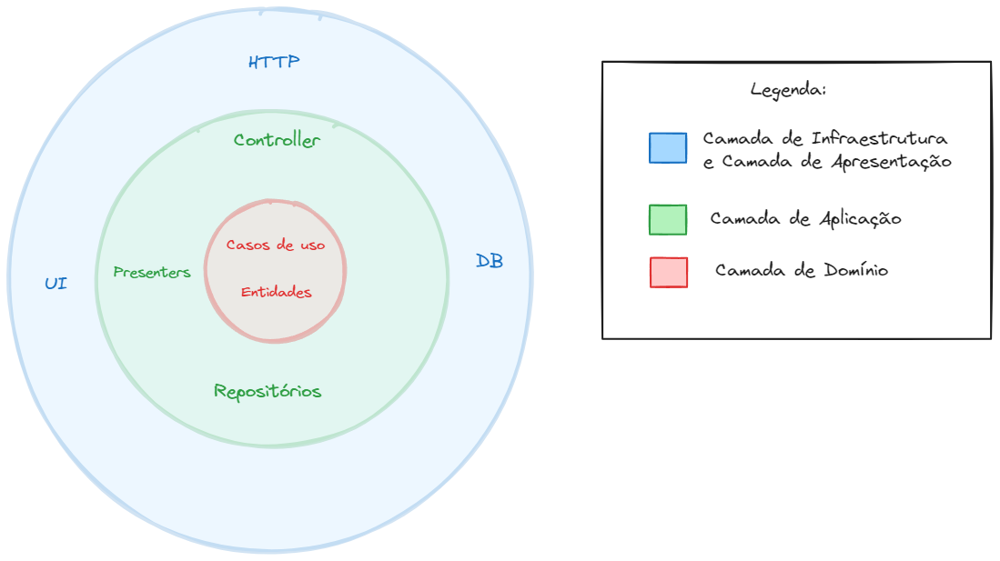
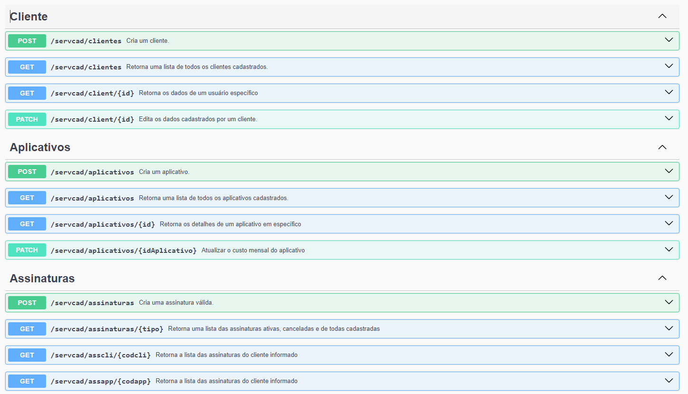
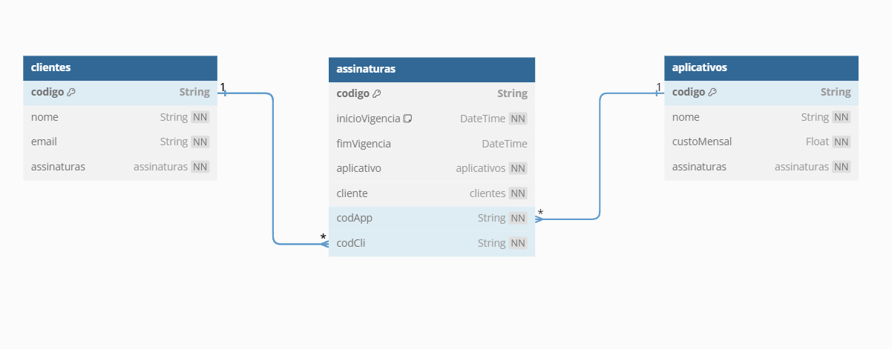

# Subscription Control System

Considerando mundo de hoje, o problema propõem a criação de uma aplicação que trabalha com o modelo de assinaturas.O cliente poderá baixar os aplicativos gratuitamente na loja, porém eles só devem estar disponíveis caso o cliente tenha um assinatura paga.

Com isto, é necessário um sistema para manter o controle das assinaturas, este sistema deve ser capaz de, periodicamente, verificar se a assinatura continua válida.
Ao assinar um aplicativo, o sistema deve automaticamente gerar um código, que juntamente com o código de identificação do cliente, fazem a liberação do aplicativo.

## Índice

- [Arquitetura](#arquitetura)
- [Rotas](#rotas)
- [Requisitos](#requisitos)
  - [Requisitos funcionais](#requisitos-funcionais)
    - [ServicoCadastramento](#servicocadastramento)
    - [ServicoPagamentos](#servicopagamentos)
    - [ServicoAssinaturasValidas](#servicoassinaturasvalidas)
  - [Requisitos não-funcionais](#requisitos-não-funcionais)
- [Entidades](#entidades)
- [Atributos](#atributos)
  - [Aplicativo](#aplicativo)
  - [Cliente](#cliente)
  - [Assinatura](#assinatura)
  - [Pagamento](#pagamento)
  - [Usuário](#usuário)
- [Diagrama UML (FASE 1)](#diagrama-uml-fase-1)
- [Executando o projeto](#executando-o-projeto)
- [Ferramentas Utilizadas para Construção da Aplicação](#ferramentas-utilizadas-para-construção-da-aplicação)
  - [Tecnologias Principais](#tecnologias-principais)
  - [Módulos do NestJS](#módulos-do-nestjs)


## Arquitetura

<div align="center" >
  
</div>
<br>

A escolha da arquitetura para o projeto foi a arquitetura de microsserviços em conjunto com o framework NestJS, que é altamente opinativo e que propõe a fácil implementação de princípios de SOLID, Clean Architecture, e DDD na elaboração do projeto back-end.

Uma arquitetura de microsserviços nos permite uma arquitetura modular e escalável, onde podemos desenvolver diversos módulos de forma independente e apenas acoplar em um serviço principal. Pode ser entendida também como uma arquitetura em 4 camadas, porém, unificando as camadas de Infraestrutura e Apresentação.

Este padrão de 4 camadas, basicamente é o DDD, que não nos impõe uma maneira específica de escrever nossas aplicações, mas oferece um conjunto de conceitos e práticas que podem ser traduzidos para código (entidades, casos de uso, etc.).

## Rotas

<div align="center" >
  
</div>
<br>

Também disponível em http://localhost:3333/docs após a inicialização do projeto.

## Requisitos

### Requisitos funcionais

#### ServicoCadastramento

- [x] Deve ser possível gerar uma lista com todos os clientes cadastrados;
- [x] Deve ser possível gerar uma lista com todos os aplicativos cadatrados;
- [x] Deve ser possível criar uma assinatura;
- [x] Deve ser possível realizar uma atualização no custo mensal dos aplicativos;
- [x] Deve ser possível retornar uma lista com todos as assinaturas vigentes;
- [x] O cliente deve ser capaz de retornar uma lista com as suas assinaturas;
- [x] Deve ser possível retornar uma lista de assinaturas por aplicativos;

#### ServicoPagamentos

- [ ] Deve ser possível solicitar o registro de um pagamento;

#### ServicoAssinaturasValidas

- [x] Deve ser possível retornar a validade de uma assinatura específica

### Requisitos não-funcionais

- [x] Deve ser previsto um script para popular o bando de dados;
- [x] Deve ser possível adicionar novos microserviços conforme necessário para atender à demanda crescente;
- [x] Todos os dados sensíveis, como informações de pagamento, devem ser armazenados de forma segura;
- [x] O sistema deve estar disponível para acesso e uso dos usuários 24 horas por dia, 7 dias por semana, com um tempo de inatividade mínimo planejado para manutenção e atualizações;
- [x] Deve haver documentação abrangente disponível para orientar os usuários sobre como utilizar o sistema de forma eficaz;

## Entidades

A aplicação deve conter as seguintes entidades: `Aplicativo`,`Cliente`,`Assinatura`,`Pagamento`,`Usuário`

## Atributos

### Aplicativo

| Atributo    | Descrição                                        | Tipo   |
| ----------- | ------------------------------------------------ | ------ |
| codigo      | Código identificador do aplicativo               | UUID   |
| nome        | Nome fantasia pelo qual o aplicativo é conhecido | String |
| custoMensal | Valor da assinatura mensal                       | Float  |

### Cliente

| Atributo | Descrição                       | Tipo   |
| -------- | ------------------------------- | ------ |
| codigo   | Código identificador do cliente | UUID   |
| nome     | Nome do cliente                 | String |
| email    | E-mail do cliente               | String |

### Assinatura

| Atributo       | Descrição                          | Tipo |
| -------------- | ---------------------------------- | ---- |
| codigo         | Código identificador da assinatura | UUID |
| codApp         | Código do aplicativo assinado      | UUID |
| codCli         | Código do cliente                  | UUID |
| inicioVigencia | Início da vigência da assinatura   | Date |
| fimVigencia    | Fim da vigência da assinatura      | Date |

### Pagamento

| Atributo      | Descrição                             | Tipo  |
| ------------- | ------------------------------------- | ----- |
| codigo        | Identificador único do pagamento      | UUID  |
| codAssinatura | Código da assinatura paga             | UUID  |
| valorPago     | Valor pago                            | Float |
| dataPagamento | Data em que o pagamento foi efetivado | Date  |

### Usuário

| Atributo | Descrição                           | Tipo   |
| -------- | ----------------------------------- | ------ |
| usuario  | Identificador do usuário para login | String |
| senha    | Senha de acesso do usuário          | String |

## Diagrama UML (FASE 1)

<div align="center" >
  
</div>
<br>

## Executando o projeto

Realizar o clone da aplicação

```bash
git clone https://github.com/RenanFachin/PUCRS_subscription-control-system.git
```

Instalar dependências

```bash
npm i
```

Subir o banco de dados PostgreSQL via docker

```bash
docker compose up -d
```

Copiar o arquivo com os dados de conexão e demais variáveis ambiente

```bash
cp .env.example .env
```

Criar as tabelas do banco de dados (em desenvolvimento)

```bash
npx prisma migrate dev
```

Execute o projeto

```bash
npm run start:dev
```

Populando o banco de dados

```bash
npx prisma db seed
```

Visualizando o banco de dados

```bash
npx prisma studio
```

Visualizando a documentação do projeto

```bash
http://localhost:3333/docs
```

Testes

```bash
npm run test
```

### 📘 Ferramentas Utilizadas para Construção da Aplicação

## Tecnologias Principais
- [NestJS](https://nestjs.com/)
- [TypeScript](https://www.typescriptlang.org/)
- [PrismaORM](https://www.prisma.io/)
- [Docker](https://www.docker.com/)
- [PostgreSQL](https://hub.docker.com/r/bitnami/postgresql)
- [Zod](https://zod.dev/)
- [DayJS](https://day.js.org/)
- [FakerJS](https://fakerjs.dev/)

## Módulos do NestJS
- [@nestjs/Swagger](https://docs.nestjs.com/openapi/introduction)
- [@nestjs/event-emitter](https://docs.nestjs.com/techniques/events)
- [@nestjs/config](https://docs.nestjs.com/techniques/configuration)